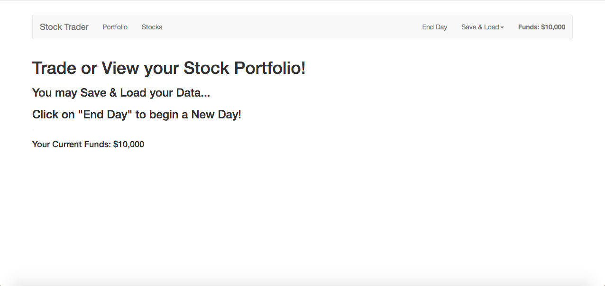
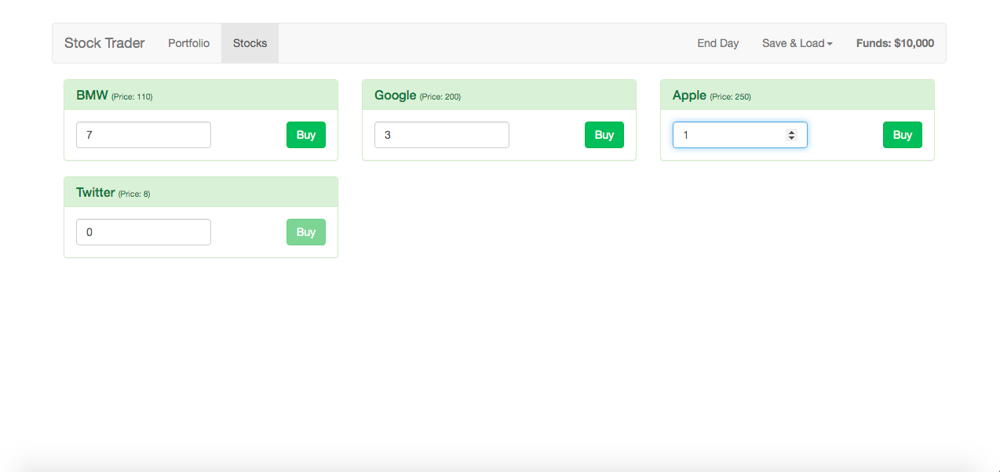
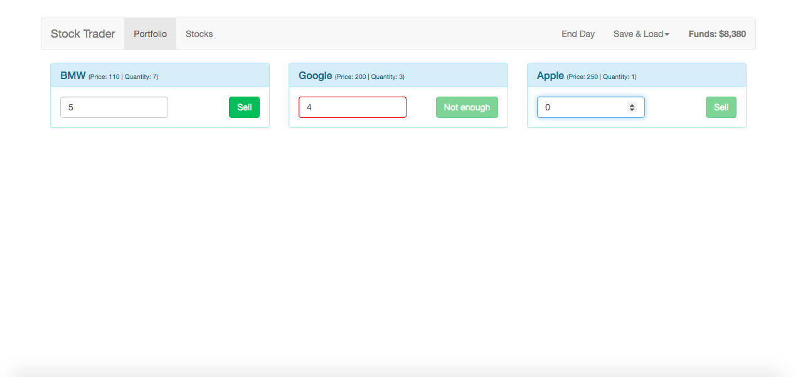

# the-stock-trader

## Description
This is an application for users to practice basic strategy in buying and selling stocks on the stock market.  The purpose of creating this application was to familiarize myself with Vue.js and to learn how to deploy applications on Amazon Web Services.

## Deployed
http://vuejs-stocks.s3-website.us-east-2.amazonaws.com

## Technologies Used
HTML5, CSS3, JavaScript, Vue.js

## Usage
On the homepage, select the "Stocks" option in the navbar. Once you are on the Stocks page then choose a stock to buy.  Decide how many shares you would like to buy and click the "Buy" button; the amount of shares you bought will be reflected.  To see how many stocks you have, select the "Portfolio" option in the navbar.  Once you are on the Portfolio page you can choose which stock shares you would like to sell.

## Contributors
Casey Maltese (self)

## Tests
None

## Contact
If you have any questions, you can contact me via email: <caseymaltese@gmail.com>

## Images
### Homepage 

### Stocks Page

### Portfolio Page
